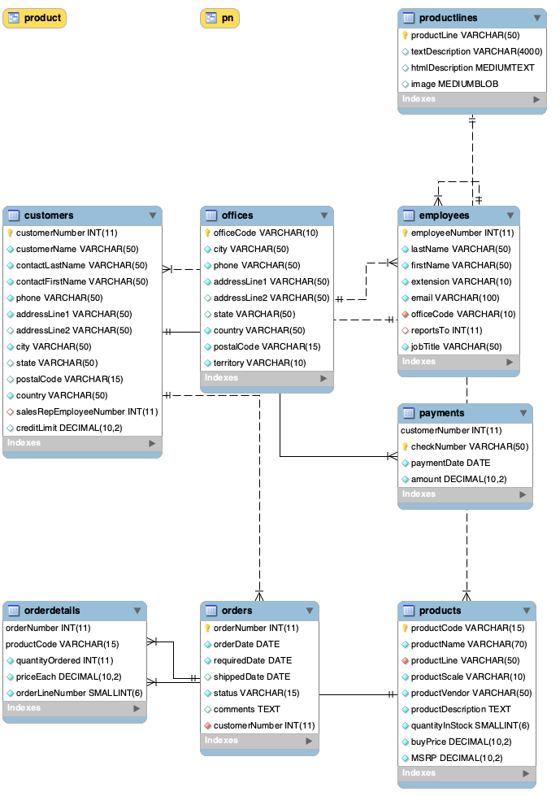

# 📊 Projet SQL – Toys & Models

---

## 🎯 Objectif
Analyser la base de données **Toys & Models** afin de mesurer la performance commerciale, la rentabilité des produits, le comportement des clients, l’efficacité des vendeurs et la qualité logistique.  
Ce projet est une première étape avant la construction d’un **dashboard interactif dans Tableau**.

---

## 🗂️ Jeu de données
Base relationnelle composée de 8 tables principales :
- **customers** : informations clients
- **orders** & **orderdetails** : commandes et détails de commandes
- **products** & **productlines** : produits et catégories
- **payments** : paiements clients
- **employees** & **offices** : structure RH et commerciale
---

## 🗺️ Schéma relationnel

Voici la structure de la base de données **Toys & Models** :  

---

## 🔍 Analyses réalisées

### 1️⃣ Analyse Ventes
- Chiffre d’affaires global et par mois/année
- Top 5 produits et catégories (quantité, valeur, bénéfice)
- Panier moyen global et par année
- Produits avec les meilleures marges

### 2️⃣ Analyse Clients
- Nombre total de clients et répartition par pays
- CA et bénéfice par client
- Panier moyen par client
- Identification des clients inactifs ou mauvais payeurs
- Retards et délais de paiement

### 3️⃣ Analyse RH
- Nombre total d’employés
- Répartition par poste et par pays
- CA généré par vendeur
- Nombre de clients par vendeur
- Association des meilleurs clients avec leur vendeur

### 4️⃣ Analyse Logistique
- Statut des commandes (livrées, en retard, annulées, en attente…)
- Délai moyen de livraison
- Suivi du solde dû par client vs limite de crédit

---

## 🛠️ Compétences SQL mobilisées
- Agrégations et KPI : `SUM`, `COUNT`, `AVG`, `ROUND`, `GROUP BY`, `HAVING`
- Analyse temporelle : `EXTRACT`, `DATEDIFF`
- Jointures multi-tables : `INNER JOIN`, `LEFT JOIN`
- Fonctions conditionnelles : `CASE WHEN`, `IFNULL`, `NULLIF`
- Sous-requêtes : clients sans commandes, clients sans paiements
- Calculs métiers : CA, bénéfices, marges, solde dû

---

---

## 📈 Dashboard interactif (Tableau)

Un dashboard a été réalisé avec Tableau pour visualiser les KPI commerciaux et clients :  
🔗 https://public.tableau.com/app/profile/eric.raoelison/viz/ToysModels_17583024820730/SalesDashboard 

---

### Points clés :
- Vue consolidée des performances 2022 vs 2023
- Top clients par profit avec exploration dynamique
- Filtres interactifs (par année, client, pays,produit et catégorie)

---

✍️ Auteur : **Eric Raoelison**
